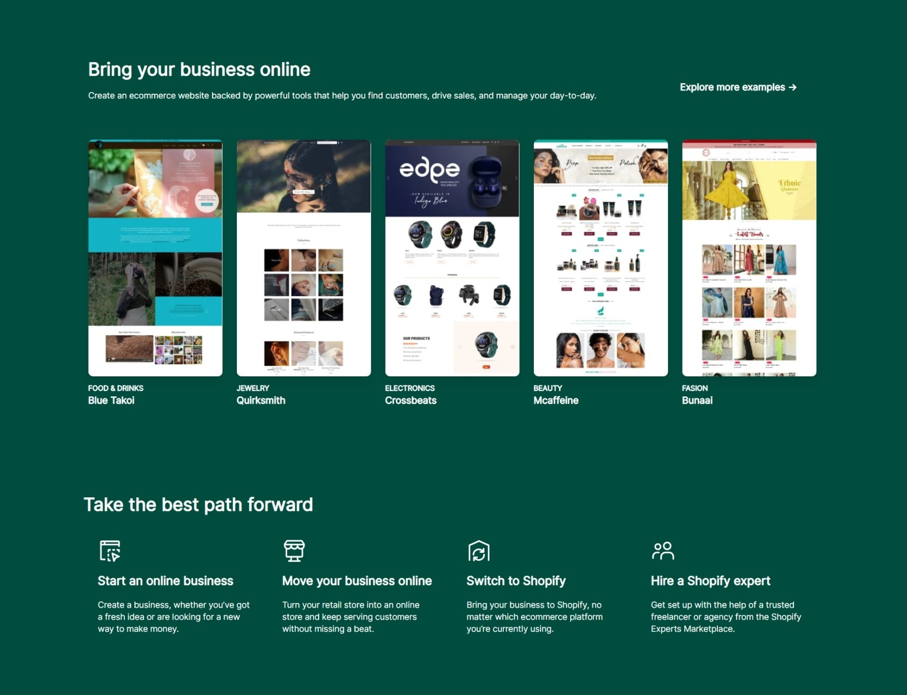
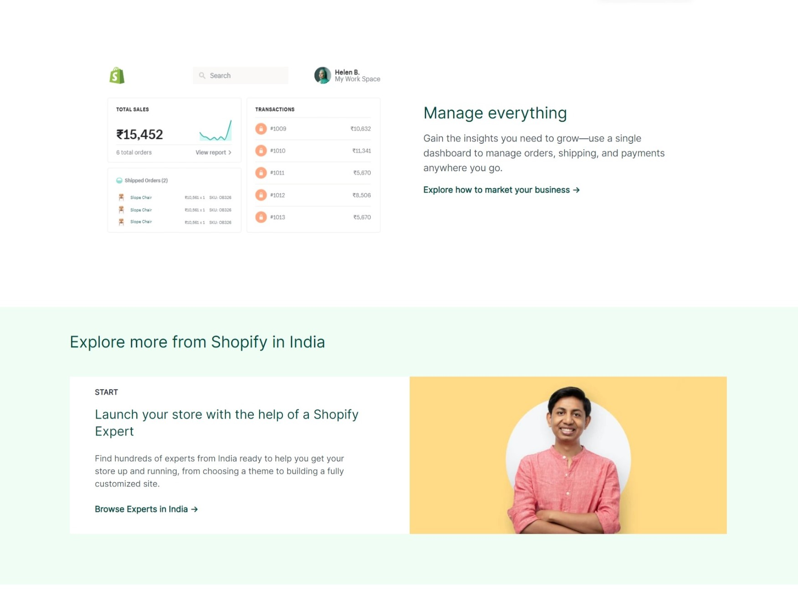
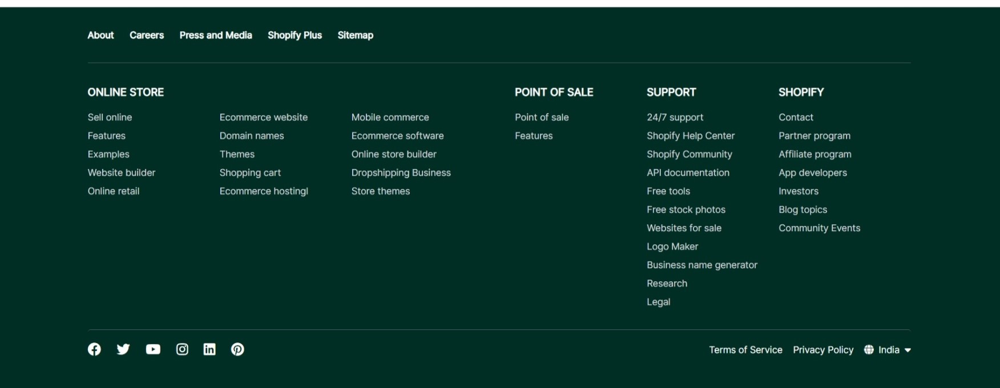

## intro

- Hey there i'm Raj Shailraj and i made this antire shopify clone site with only HTML and Tailwind CSS.

## Outcomes

- In this tailwind css project. i got lot of knowledge about diffrent classes, how to use min-width ,screens ,flex ,Grid etc. 

- Use config script and change screen size and add my colors.

- Now i'm more confidant about making any type of site using tailwind CSS.

- Making diffrent card and also make responsive.

- use of tailblock , dropdown , hover , focus etc.

## Time to finish this site

- it's take near about 2 week (It iclude learning Tailwind Doc and understading and for fix small style / responsiveness , error etc.)

## Deploye link

- [shopify-clone-by-shailraj](https://shopifty-clone-shailraj.netlify.app/)

## Screenshots

 

